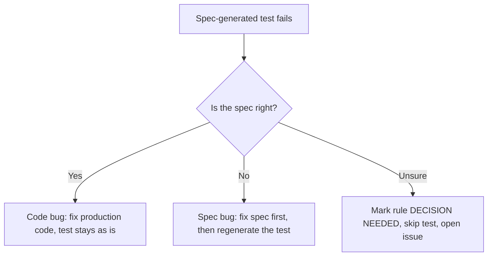

# Research: Declarative Behavior Specifications for Test Generation

- **Date**: 2026-10-05
- **Question**: How can expected behavior be described briefly and precisely (English/Russian), so that AI generates tests from the *intent* and not from the implementation?
- **Related ADR**: [ADR-001](../adr/ADR-001-declarative-test-specifications.md)

This note has worked examples for **Option 2** (scenario tables) and **Option 3** (markdown rule
specs + blind generation), based on the current `domain` crate. All examples use the real API
(`DocumentInstance`, `AccessRequest`, `AuthorizationService`, `validate_content`) and
`domain::test_support`.

> [!NOTE]
> These examples are **illustrations, not committed tests**. Runner code is a sketch and has not been compiled.
> Rules marked `⚠️ DECISION NEEDED` describe behavior that is currently undefined or contradictory. The examples do not decide it.

---

## Contents

1. [Rule-writing conventions (shared by both options)](#1-rule-writing-conventions)
2. [Option 2: Scenario tables](#2-option-2--scenario-tables)
   - 2.1 Document lifecycle (state machine)
   - 2.2 Authorization (decision table)
   - 2.3 Access request (state machine)
   - 2.4 Content validation (decision table)
   - 2.5 Runner sketch
3. [Option 3: Markdown rule specs + blind generation](#3-option-3--markdown-rule-specs--blind-generation)
   - 3.1 Spec file layout
   - 3.2 Spec examples (EN + RU)
   - 3.3 Blind-generation prompt
   - 3.4 Example generated tests
   - 3.5 Triage of a red test
4. [Findings discovered while writing the specs](#4-findings-discovered-while-writing-the-specs)
5. [Use-case examples (application layer) — pending](#5-use-case-examples-application-layer--pending)
6. [Sources](#6-sources)

---

## 1. Rule-writing conventions

The same conventions keep both formats precise:

| Convention | Why |
|---|---|
| **One rule = one action.** `given` (state) → `when` (exactly one call) → `then` (observable outcome) | Each rule is atomic and maps to one test |
| **Stable rule ID** `<AREA>-<NN>` (e.g. `LC-03`) | Traceability: rule ↔ test ↔ commit |
| **Observable outcomes only**: returned value, public state, error *kind* | No coupling to private implementation |
| **Error by kind**, e.g. `InvalidStateTransition`, `Validation`, `InvalidFieldValue(title)` | `DomainError` is not `PartialEq`; message text is not part of the contract |
| **Symbolic values**: users `alice`, `owner`; times `t0`, `t1`; types `article` | Readable; the runner/test maps them via `test_support` |
| **Unchanged-on-error is explicit**: `state: unchanged` | Catches partial mutation before the error is returned |

Area prefixes used below: `LC` lifecycle, `AZ` authorization, `AR` access request, `VC` content validation.

---

## 2. Option 2 — Scenario tables

Proposed layout:

```
domain/tests/
├── scenarios/
│   ├── lifecycle.yaml          # DocumentInstance publish/unpublish
│   ├── authorization.yaml      # AuthorizationService::can
│   ├── access_request.yaml     # AccessRequest approve/reject
│   └── content_validation.yaml # validate_content
└── scenario_runner.rs          # harness = false; one runner module per file
```

### 2.1 Document lifecycle — `lifecycle.yaml`

Background: `DocumentInstance::new` creates a `Draft { last_published_revision: None }` with `audit.version = 1`.

```yaml
# Vocabulary
#   given.state:  draft | draft(last=N) | published(rev=N)
#   when.action:  publish | unpublish
#   then:         state, returns, version_delta, updated_by, published_by, error, state: unchanged

defaults:
  type: article
  owner: alice
  actor: bob

scenarios:
  - id: LC-01
    title: Publishing a new draft creates revision 1
    given: { state: draft }
    when:  { action: publish, by: bob, at: t1 }
    then:
      state: published(rev=1)
      returns: 1
      published_by: bob
      published_at: t1
      updated_by: bob
      version_delta: +1

  - id: LC-02
    title: Re-publishing a published document advances the revision
    given: { state: published(rev=1) }
    when:  { action: publish, by: bob, at: t2 }
    then:  { state: published(rev=2), returns: 2, version_delta: +1 }

  - id: LC-03
    title: Publishing a previously-unpublished draft continues the revision sequence
    given: { state: draft(last=3) }
    when:  { action: publish, by: bob, at: t1 }
    then:  { state: published(rev=4), returns: 4 }

  - id: LC-04
    title: Unpublishing remembers the last published revision
    given: { state: published(rev=2) }
    when:  { action: unpublish, at: t1 }
    then:  { state: draft(last=2), version_delta: +1 }

  - id: LC-05
    title: Unpublishing a draft is rejected and changes nothing
    given: { state: draft }
    when:  { action: unpublish, at: t1 }
    then:  { error: InvalidStateTransition, state: unchanged }

  # ⚠️ DECISION NEEDED — `unpublish` takes no actor today, so `updated_by` keeps the previous value.
  # - id: LC-06
  #   title: Unpublishing records who unpublished
  #   given: { state: published(rev=1) }
  #   when:  { action: unpublish, by: carol, at: t1 }
  #   then:  { updated_by: carol }
```

**Review cost:** the whole publication state machine is about 40 lines and can be checked in under a minute.

### 2.2 Authorization — `authorization.yaml`

A decision table works best as one row per case:

```yaml
# Permission syntax:  Action(type) | Action(*)  (* = wildcard / None)
#                     ManageSchema | ManageRoles | ManageUsers

roles:
  admin:           [ManageSchema, ManageRoles, ManageUsers,
                    CreateDocument(*), ReadDocument(*), UpdateDocument(*),
                    DeleteDocument(*), PublishDocument(*)]
  reader:          [ReadDocument(*)]
  article-editor:  [ReadDocument(article), UpdateDocument(article)]
  publisher:       [PublishDocument(article)]

cases:
  # id     user    action                    instance_owner  roles              expect
  - { id: AZ-01, user: alice, action: ReadDocument(article),    owner: alice, roles: [],               expect: allow }
  - { id: AZ-02, user: alice, action: UpdateDocument(article),  owner: alice, roles: [],               expect: allow }
  - { id: AZ-03, user: alice, action: PublishDocument(article), owner: alice, roles: [],               expect: deny  }
  - { id: AZ-04, user: alice, action: DeleteDocument(article),  owner: alice, roles: [],               expect: deny  }
  - { id: AZ-05, user: bob,   action: ReadDocument(article),    owner: alice, roles: [],               expect: deny  }
  - { id: AZ-06, user: bob,   action: ReadDocument(article),    owner: alice, roles: [reader],         expect: allow }
  - { id: AZ-07, user: bob,   action: UpdateDocument(author),   owner: alice, roles: [article-editor], expect: deny  }
  - { id: AZ-08, user: bob,   action: UpdateDocument(article),  owner: alice, roles: [article-editor], expect: allow }
  - { id: AZ-09, user: alice, action: PublishDocument(article), owner: alice, roles: [publisher],      expect: allow }
  - { id: AZ-10, user: bob,   action: ManageSchema,             owner: null,  roles: [article-editor], expect: deny  }
  - { id: AZ-11, user: bob,   action: ManageSchema,             owner: null,  roles: [admin],          expect: allow }
  - { id: AZ-12, user: bob,   action: DeleteDocument(article),  owner: null,  roles: [reader, publisher], expect: deny }
```

`AZ-03`/`AZ-04` capture the editorial-workflow rule ("authors cannot self-publish or self-delete").
The doc comment on `AuthorizationService::can` currently says otherwise; see [§4](#4-findings-discovered-while-writing-the-specs).

### 2.3 Access request — `access_request.yaml`

```yaml
defaults: { requester: alice, reviewer: admin }

scenarios:
  - id: AR-01
    title: Approving a pending request grants exactly the selected roles
    given: { status: pending }
    when:  { action: approve, roles: [editor, publisher] }
    then:
      status: approved
      reviewed_by: admin
      assigned_roles: [editor, publisher]
      returns_assignments: { count: 2, user: alice, granted_by: admin }

  - id: AR-02
    title: Approval without roles is rejected
    given: { status: pending }
    when:  { action: approve, roles: [] }
    then:  { error: Validation, status: unchanged }

  - id: AR-03
    title: Approval with more than MAX_ROLES (50) roles is rejected
    given: { status: pending }
    when:  { action: approve, roles: { generate: 51 } }
    then:  { error: Validation, status: unchanged }

  - id: AR-04
    title: An already-reviewed request cannot be approved again
    given: { status: approved }
    when:  { action: approve, roles: [editor] }
    then:  { error: InvalidStateTransition }

  - id: AR-05
    title: Rejecting a pending request stores the reason
    given: { status: pending }
    when:  { action: reject, reason: "Unknown person" }
    then:  { status: rejected("Unknown person"), reviewed_by: admin }

  - id: AR-06
    title: An approved request cannot be rejected
    given: { status: approved }
    when:  { action: reject }
    then:  { error: InvalidStateTransition }

  - id: AR-07
    title: Only pending and approved requests are active
    table:
      - { status: pending,  is_active: true  }
      - { status: approved, is_active: true  }
      - { status: rejected, is_active: false }

  # ⚠️ DECISION NEEDED — self-approval is currently allowed.
  # - id: AR-08
  #   given: { status: pending, requester: admin }
  #   when:  { action: approve, by: admin, roles: [editor] }
  #   then:  { error: Unauthorized }
```

### 2.4 Content validation — `content_validation.yaml`

The schema is declared once; each case only lists content and expected errors.

```yaml
system: { locales: [en, uk], default: en }

document_type:
  id: article
  fields:
    - { name: title,   type: text,            required: true,  min_len: 3, max_len: 10 }
    - { name: slug,    type: text,            pattern: "^[a-z-]+$" }
    - { name: rating,  type: integer(i32),    min: 1, max: 5 }
    - { name: price,   type: decimal(10,2) }
    - { name: summary, type: localized_text,  max_len: 5 }

cases:
  - id: VC-01
    title: Fully valid content passes
    content: { title: "Hello", slug: "hello-world", rating: 4, price: "9.99",
               summary: { en: "Hi", uk: "Вітаю" } }
    expect: ok

  - id: VC-02
    title: Missing required field
    content: { slug: "a" }
    expect: [InvalidFieldValue(title)]

  - id: VC-03
    title: Explicit null on required field is the same as missing
    content: { title: null }
    expect: [InvalidFieldValue(title)]

  - id: VC-04
    title: Length is counted in characters, not bytes
    content: { title: "Привіт" }        # 6 chars, 12 bytes
    expect: ok

  - id: VC-05
    title: All violations are reported, not only the first
    content: { title: "Hi", slug: "Bad Slug", rating: 9 }
    expect: [InvalidFieldValue(title), InvalidFieldValue(slug), InvalidFieldValue(rating)]

  - id: VC-06
    title: Unknown locale in localized field
    content: { title: "Hello", summary: { fr: "Salut" } }
    expect: [UnknownLocale(fr)]

  - id: VC-07
    title: Constraints apply per locale
    content: { title: "Hello", summary: { en: "Hi", uk: "Занадто довго" } }
    expect: [InvalidFieldValue(summary)]

  - id: VC-08
    title: Undeclared attribute is rejected
    content: { title: "Hello", author-name: "X" }
    expect: [UnknownAttribute(author-name)]

  - id: VC-09
    title: Type mismatch skips constraint evaluation for that field
    content: { title: 42 }
    expect: [InvalidFieldValue(title)]   # exactly one error, not type + length

  - id: VC-10
    title: Decimal scale beyond the declared scale is rejected
    content: { title: "Hello", price: "9.999" }
    expect: [InvalidFieldValue(price)]
```

`expect` is compared as a **multiset of error kinds**, so the error order is not part of the contract.

### 2.5 Runner sketch (lifecycle)

One test per scenario via [`libtest-mimic`](https://docs.rs/libtest-mimic), so `cargo test LC-04` works and failures name the rule.

```toml
# domain/Cargo.toml
[dev-dependencies]
domain = { path = ".", features = ["test-support"] }
libtest-mimic = "0.8"
serde = { version = "1", features = ["derive"] }
serde_norway = "0.9"   # maintained serde_yaml fork — see ADR open questions

[[test]]
name = "scenarios"
path = "tests/scenario_runner.rs"
harness = false
```

```rust
// domain/tests/scenario_runner.rs  (sketch)
use libtest_mimic::{Arguments, Failed, Trial};
use serde::Deserialize;

use domain::content::{DocumentInstance, PublicationState};
use domain::errors::DomainError;
use domain::test_support::{fixture_document_instance, test_user_id};

#[derive(Deserialize)]
#[serde(deny_unknown_fields)]           // typos in specs fail loudly
struct Scenario { id: String, title: String, given: Given, when: When, then: Then }

#[derive(Deserialize)] #[serde(deny_unknown_fields)]
struct Given { state: String }

#[derive(Deserialize)] #[serde(deny_unknown_fields)]
struct When { action: String, by: Option<String>, at: String }

#[derive(Deserialize, Default)] #[serde(deny_unknown_fields, default)]
struct Then {
    state: Option<String>,               // "published(rev=2)" | "draft(last=2)" | "unchanged"
    returns: Option<u32>,
    version_delta: Option<i32>,
    updated_by: Option<String>,
    published_by: Option<String>,
    published_at: Option<String>,
    error: Option<String>,               // DomainError variant name
}

fn main() {
    let args = Arguments::from_args();
    let file: LifecycleFile = serde_norway::from_str(include_str!("scenarios/lifecycle.yaml")).unwrap();
    let trials = file.scenarios.into_iter()
        .map(|s| Trial::test(format!("{} {}", s.id, s.title), move || run(&s)))
        .collect();
    libtest_mimic::run(&args, trials).exit();
}

fn run(s: &Scenario) -> Result<(), Failed> {
    let clock = Clock::default();                          // t0, t1, … → fixed DateTime<Utc>
    let mut doc = fixture_document_instance("article", Some("alice"));
    doc.content.publication_state = parse_state(&s.given.state, &clock)?;
    let before = doc.clone();

    let result: Result<Option<u32>, DomainError> = match s.when.action.as_str() {
        "publish"   => doc.publish(s.when.by.as_deref().map(test_user_id), clock.at(&s.when.at)).map(Some),
        "unpublish" => doc.unpublish(clock.at(&s.when.at)).map(|_| None),
        other       => return Err(format!("unknown action '{other}'").into()),
    };

    match (&s.then.error, result) {
        (Some(kind), Err(e))  => ensure_eq(kind, error_kind(&e), "error kind")?,
        (Some(kind), Ok(_))   => return Err(format!("expected error {kind}, got Ok").into()),
        (None, Err(e))        => return Err(format!("unexpected error: {e}").into()),
        (None, Ok(ret))       => if let Some(exp) = s.then.returns { ensure_eq(&Some(exp), &ret, "returns")? },
    }

    match s.then.state.as_deref() {
        Some("unchanged") => ensure_eq(&before, &doc, "state")?,
        Some(st)          => ensure_state(st, &doc.content.publication_state)?,
        None              => {}
    }
    if let Some(d) = s.then.version_delta {
        ensure_eq(&(before.audit.version as i32 + d), &(doc.audit.version as i32), "version")?;
    }
    // updated_by / published_by / published_at checks are similar
    Ok(())
}

/// Maps a DomainError to its variant name — the only error contract specs rely on.
fn error_kind(e: &DomainError) -> &'static str {
    match e {
        DomainError::InvalidStateTransition { .. } => "InvalidStateTransition",
        DomainError::Validation(_)                 => "Validation",
        DomainError::InvalidFieldValue { .. }      => "InvalidFieldValue",
        DomainError::UnknownLocale(_)              => "UnknownLocale",
        DomainError::UnknownAttribute(_)           => "UnknownAttribute",
        DomainError::Unauthorized(_)               => "Unauthorized",
        _                                          => "Other",
    }
}
```

**Cost profile:** about 150 lines of runner per scenario file, written once (by AI, reviewed once).
After that, every new behavior is a few lines of YAML.

---

## 3. Option 3 — Markdown rule specs + blind generation

### 3.1 Spec file layout

```
docs/specs/
├── TEMPLATE.md
├── domain/
│   ├── document-lifecycle.md
│   ├── authorization.md
│   ├── access-request.md
│   └── content-validation.md
└── use-cases/                 # added after the application crate exists
    └── …
```

Template (each rule fixed to Given / When / Then, with no extra prose inside a rule):

```markdown
# Spec: <Area>
- **Subject**: <public type / function under test>
- **Rule prefix**: <XX>
- **Language**: en | ru

## Background
<Shared facts that apply to every rule.>

## Rules
### XX-01 <Short title>
- **Given** …
- **When** …
- **Then** …
```

### 3.2 Spec examples

#### `docs/specs/domain/document-lifecycle.md` (English)

```markdown
# Spec: Document publication lifecycle
- **Subject**: `DocumentInstance::publish`, `DocumentInstance::unpublish`
- **Rule prefix**: LC

## Background
- A new instance is a Draft with no published revision and audit version 1.
- Every successful state change increases audit version by exactly 1.
- A failed operation leaves the instance completely unchanged.

## Rules
### LC-01 Publishing a new draft creates revision 1
- **Given** a new draft
- **When** bob publishes it at t1
- **Then** it is Published with revision 1, published_by = bob, published_at = t1
- **And** publish returns 1, updated_by = bob

### LC-02 Re-publishing advances the revision
- **Given** a document Published with revision 1
- **When** it is published again
- **Then** it is Published with revision 2

### LC-03 Revision sequence survives unpublishing
- **Given** a Draft whose last published revision is 3
- **When** it is published
- **Then** it is Published with revision 4

### LC-04 Unpublishing remembers the last revision
- **Given** a document Published with revision 2
- **When** it is unpublished
- **Then** it is a Draft with last published revision 2

### LC-05 A draft cannot be unpublished
- **Given** a draft
- **When** it is unpublished
- **Then** the error is InvalidStateTransition

### LC-06 ⚠️ DECISION NEEDED — Unpublishing records the actor
- **Given** a document Published with revision 1
- **When** carol unpublishes it
- **Then** updated_by = carol
```

#### `docs/specs/domain/authorization.md` (Russian — the same template works)

```markdown
# Спецификация: Авторизация доступа к документам
- **Subject**: `AuthorizationService::can`
- **Rule prefix**: AZ
- **Language**: ru

## Контекст
- Запрет по умолчанию: если ни одно правило не разрешает действие — доступ запрещён.
- Разрешение `Action(*)` действует на любой тип документа.

## Правила
### AZ-01 Владелец читает и редактирует свой документ без ролей
- **Дано** документ `article`, созданный alice; у alice нет ролей
- **Когда** alice выполняет `ReadDocument(article)` или `UpdateDocument(article)`
- **Тогда** доступ разрешён

### AZ-02 Владелец не может сам опубликовать или удалить документ
- **Дано** документ `article`, созданный alice; у alice нет ролей
- **Когда** alice выполняет `PublishDocument(article)` или `DeleteDocument(article)`
- **Тогда** доступ запрещён

### AZ-03 Роль с конкретным типом не действует на другие типы
- **Дано** у bob роль с `UpdateDocument(article)`
- **Когда** bob выполняет `UpdateDocument(author)`
- **Тогда** доступ запрещён

### AZ-04 Права нескольких ролей объединяются
- **Дано** у bob роли `reader` (`ReadDocument(*)`) и `publisher` (`PublishDocument(article)`)
- **Когда** bob выполняет `ReadDocument(article)`, затем `PublishDocument(article)`
- **Тогда** оба действия разрешены
```

### 3.3 Blind-generation prompt

What makes it "blind" is the **context the AI gets**, not the wording of the prompt.

```text
ROLE: Test author. You have NOT seen the implementation.

INPUT (the only allowed context):
  1. docs/specs/domain/document-lifecycle.md
  2. Public signatures of: DocumentInstance, PublicationState, AuditTrail, DomainError
     (from `cargo doc` output or docs/api-surface/domain.md — NOT from src/**)
  3. domain/src/test_support/** (fixtures and builders)

TASK:
  - Generate one #[test] per rule, named `<rule_id_snake>_<title_snake>`, e.g. `lc_04_unpublishing_remembers_last_revision`.
  - Assert only what the rule states. Do not add assertions the rule does not state.
  - Skip rules marked "DECISION NEEDED"; list them in your report.
  - Run `cargo test -p domain`.

ON FAILURE:
  - Do NOT change the assertion and do NOT change production code.
  - Report: rule ID, expected (from spec), actual (from test output).
```

Ways to enforce blindness, from weakest to strongest:

| Level | Mechanism |
|---|---|
| 1 | Instruction only ("don't open `src/**` except `test_support`") |
| 2 | Run a subagent whose file access is limited to `docs/specs/` + a generated API summary |
| 3 | Generate the API summary from signatures (e.g. `cargo doc --no-deps` → JSON / rustdoc-json) so the bodies are not in the input at all |

### 3.4 Example generated tests

The output is plain Rust that uses `test_support`; the only new information it carries is the rule ID.

```rust
// domain/src/content/instance.rs — #[cfg(test)] mod spec_lifecycle
use super::*;
use chrono::{Duration, Utc};
use crate::test_support::{fixture_document_instance, test_user_id};

/// LC-03 Revision sequence survives unpublishing
#[test]
fn lc_03_revision_sequence_survives_unpublishing() {
    let mut doc = fixture_document_instance("article", Some("alice"));
    doc.content.publication_state = PublicationState::Draft { last_published_revision: Some(3) };

    let rev = doc.publish(Some(test_user_id("bob")), Utc::now()).unwrap();

    assert_eq!(rev, 4);
    assert!(matches!(doc.content.publication_state, PublicationState::Published { revision: 4, .. }));
}

/// LC-05 A draft cannot be unpublished (Background: failed operation leaves instance unchanged)
#[test]
fn lc_05_draft_cannot_be_unpublished() {
    let mut doc = fixture_document_instance("article", Some("alice"));
    let before = doc.clone();

    let err = doc.unpublish(Utc::now() + Duration::seconds(1)).unwrap_err();

    assert!(matches!(err, DomainError::InvalidStateTransition { .. }));
    assert_eq!(doc, before);
}
```

```rust
// domain/src/auth/service.rs — #[cfg(test)] mod spec_authorization
/// AZ-02 Владелец не может сам опубликовать или удалить документ
#[test]
fn az_02_owner_cannot_self_publish_or_delete() {
    let alice = test_user_id("alice");
    let doc = fixture_document_instance("article", Some("alice"));
    let article = test_doc_type_id("article");

    for action in [
        Permission::PublishDocument(Some(article.clone())),
        Permission::DeleteDocument(Some(article.clone())),
    ] {
        assert!(!AuthorizationService::can(&alice, &action, Some(&doc), &[]), "{action:?}");
    }
}
```

### 3.5 Triage of a red test

Every failure is classified by a human:



The rule "**never edit an assertion to make it pass**" is what makes the suite independent of the implementation.

---

## 4. Findings discovered while writing the specs

Writing these specs (without running anything) surfaced three gaps in the current domain:

| # | Area | Observation | Spec status |
|---|---|---|---|
| F1 | `AuthorizationService::can` | The doc comment says the owner may "read, update, delete, publish". The code and inline comment allow only read/update. | YAML `AZ-03`/`AZ-04` and markdown `AZ-02` follow the inline comment (editorial workflow). The doc comment needs a fix, or the rule is wrong. |
| F2 | `DocumentInstance::unpublish` | Takes no actor, so `audit.updated_by` keeps the previous editor after an unpublish. `publish` does record the actor. | `LC-06` ⚠️ DECISION NEEDED |
| F3 | `AccessRequest::approve` | A reviewer can approve their own access request (`by == user_id`). | `AR-08` ⚠️ DECISION NEEDED |

These are the kind of issues that implementation-derived tests never find.

---

## 5. Use-case examples (application layer) — pending

To be written after the `application` crate is implemented. Planned content:

- Option 3 spec for each use case (e.g. `CreateDocumentInstance`, `PublishDocument`, `ApproveAccessRequest`), covering authorization, repository interactions, and error mapping.
- Generated async tests using in-memory fake repositories (`DocumentInstanceRepository`, `AccessRequestRepository`, `RoleRepository`) plus `domain::test_support`.
- An evaluation of whether Option 2 scenario tables still pay off at this layer (multi-step flows, side effects on repositories).

---

## 6. Sources

- [cucumber-rs book](https://cucumber-rs.github.io/cucumber/main/) — Gherkin in Rust, `# language:` support
- [Gherkin reference — spoken languages](https://cucumber.io/docs/gherkin/languages/)
- [libtest-mimic](https://docs.rs/libtest-mimic) — custom test harness, one trial per scenario
- [datatest-stable](https://docs.rs/datatest-stable) — file-driven tests on stable Rust
- [serde_yaml repository (archived)](https://github.com/dtolnay/serde-yaml)
- [proptest book](https://proptest-rs.github.io/proptest/)
- Martin Fowler, [Specification by Example](https://martinfowler.com/bliki/SpecificationByExample.html)
